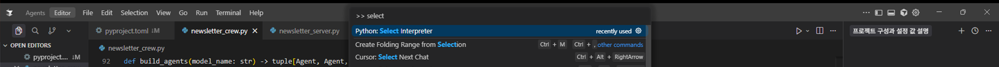
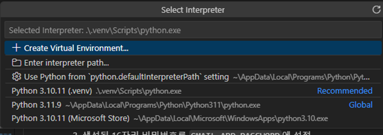

# CrewAI + MCP 뉴스레터 에이전트

CrewAI 멀티 에이전트와 MCP 도구를 결합한 뉴스레터 자동화 시스템입니다.

## 기능

- **뉴스 수집**: TechCrunch RSS에서 최신 AI/Tech 뉴스를 자동으로 수집
- **뉴스레터 제작**: 수집된 뉴스를 한국어로 큐레이션하고 HTML 뉴스레터로 생성
- **이메일 발송**: 완성된 뉴스레터를 Gmail SMTP를 통해 자동 발송

## 사전 요구사항

1. Python 3.12 이상
2. uv 패키지 매니저
3. OpenAI API 키
4. Gmail 계정 및 앱 비밀번호

## 설정

### 1. 환경 변수 설정

프로젝트 루트에 `.envex` 파일을 `.env`로 변경하고 다음 환경 변수를 설정하세요:

```bash
# OpenAI API 설정 (필수)
OPENAI_API_KEY=your_openai_api_key_here

# 모델 설정 (선택사항, 기본값: gpt-4o-mini)
OPENAI_MODEL=gpt-4o-mini

# Gmail SMTP 설정 (필수)
GMAIL_USER=your_email@gmail.com
GMAIL_APP_PASSWORD=your_gmail_app_password

# 수신자 이메일 (선택사항, GMAIL_USER가 기본값으로 사용됨)
RECIPIENT_EMAIL=recipient@example.com
```

### 2. Gmail 앱 비밀번호 생성 방법

1. Google 계정 설정 → 보안 → 2단계 인증 활성화
2. 앱 비밀번호 생성: https://myaccount.google.com/apppasswords
3. 생성된 16자리 비밀번호를 `GMAIL_APP_PASSWORD`에 설정

## 실행

### 파이썬 설정

상단 중간에 '>> Select Interpreter' 를 검색하여 </br></br>



이와 같이 python이 있는지 확인해주세요.</br>
만약, 파이썬이 없다면 인터넷에서 설치 후 아래 단계를 진행해주세요.</p>
화면과 같이 파이썬 버전들이 하나 이상 뜬다면 그 중 하나를 선택해주세요.</p> 
(저희가 테스트 한 환경은 3.10 버전이기에 해당 버전을 권장드립니다.)
</p>

### 기본 실행 (환경 변수에서 이메일 읽기)

```bash
# 의존성 설치
pip install -r requirements.txt

# 실행 (GMAIL_USER 또는 RECIPIENT_EMAIL 환경 변수 사용)
python newsletter_crew.py
```

### 이메일 주소 직접 지정

```bash
python newsletter_crew.py --email recipient@example.com
```

### 모델 변경

```bash
uv run python newsletter_crew.py --model gpt-4o
```

## 실행 결과

시스템은 다음 3단계를 순차적으로 실행합니다:

1. **뉴스 수집** (News Researcher 에이전트)
   - TechCrunch RSS에서 최신 뉴스 5개 수집
   - 중요도에 따라 상위 3개 선별

2. **뉴스레터 제작** (Content Editor 에이전트)
   - 뉴스를 한국어로 큐레이션
   - HTML 뉴스레터 생성 (제목: "AI 뉴스레터 - [오늘 날짜]")

3. **뉴스레터 발송** (Email Campaign Manager 에이전트)
   - 완성된 HTML 뉴스레터를 이메일로 발송

## 문제 해결

### 이메일 발송 실패
- Gmail 앱 비밀번호가 올바른지 확인
- 2단계 인증이 활성화되어 있는지 확인
- GMAIL_USER와 GMAIL_APP_PASSWORD 환경 변수가 올바르게 설정되었는지 확인

### API 키 오류
- OPENAI_API_KEY 환경 변수가 올바르게 설정되었는지 확인
- API 키가 유효한지 확인

